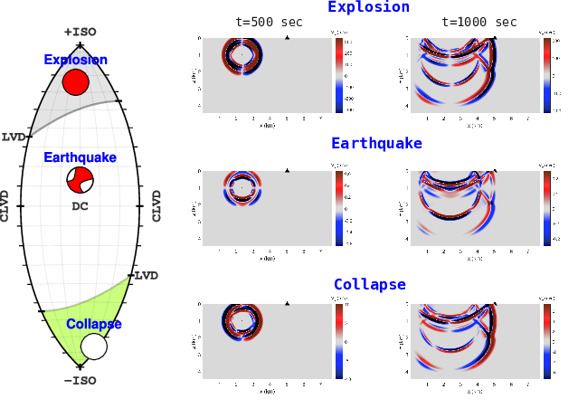

# A GPU Solver for Wave Propagation in Anisotropic Media with Moment-Tensor Sources

> Version 1.4 — September 2025

This repository contains a fast GPU elastodynamic solver for modeling wave propagation in 3D from earthquakes, explosions, collapses, and other seismic sources. 
The solver implements linear elasticity in anisotropic or isotropic media using a finite-difference time-domain (FDTD) scheme on structured grids. 
Source terms include full moment tensors (DC, CLVD, ISO, etc.) and pressure sources. 
Single-GPU execution is done via CUDA C. Input generation, compilation, and postprocessing are handled in MATLAB.



---

## Features

- **Physics**: Linear elastic, isotropic or orthorhombic media  
- **Numerics**: Staggered-grid FDTD, second-order accuracy  
- **Sources**: Full moment tensor or pressure injection  
- **Boundaries**: Simple PML absorbing layers  
- **Source time functions**: Ricker wavelets  
- **Precision**: Single or double  
- **Execution**: Single GPU, fixed grid in device memory  

---

## Workflow

- **Interface**: MATLAB-driven control  
- **Grid setup**: Defined in `vizme_FastBiotED_GPU3D_OK_2024_final.m`  
- **Moment tensor modeling**: Lune-based, direct tensor injection  
- **Compilation**: CUDA code compiled from MATLAB via system call  
- **Execution**: Platform-specific binary (`a.out` or `.exe`)  
- **Output**: Binary files with seismograms and optional snapshots  

---

## Usage

### Input
Model parameters, grid configuration, and source specifications are defined and
managed by the MATLAB script `vizme_FastBiotED_GPU3D_OK_2024_final.m`, which
prepares inputs, compiles the CUDA kernel, executes the solver, and visualizes
the output.

### Output
Seismograms are written in binary format (e.g., `*_Rec_y2.res`) at
user-specified receiver locations. Optional 3D field snapshots can also be
saved. All outputs are read, processed, and visualized in MATLAB using built-in
or user-defined routines.

### Example usage

1. Open MATLAB and navigate to:
   ```
   FastWaveED_GPU3D_v1_DC_Earthquake_FULL_OK4_final/
   ```
2. Run the main script:
   ```matlab
   vizme_FastBiotED_GPU3D_OK_2024_final
   ```

   This script performs the following:
   - Defines model parameters, source, and grid
   - Prepares input files for the solver
   - Compiles the CUDA kernel using `nvcc`, e.g.: 
     ```bash
     nvcc -arch=sm_89 -O3 -DNBX=12 -DNBY=12 -DNZ=7 \
          -DOVERX=0 -DOVERY=0 -DOVERZ=0 \
          -DNPARS1=10 -DNPARS2=13 -DNPARS3=15 \
          FastWaveED_GPU3D_v1.cu
     ```
   - Launches the solver:
     - On Linux: `a.out`
     - On Windows: `a.exe`
   - Reads and visualizes output seismograms and snapshots in MATLAB 


#### Platform note

On Linux, disable the block marked "THE FOLLOWING IS WINDOWS RELATED. SHOULD BE DISABLED WHEN COMPILING ON LINUX." 
(the `vscprintf`/`vasprintf` helpers). 
These functions size and allocate formatted strings from a va_list and are required only on Windows.

---

## Simulation Variants

The `src/` directory contains different simulation setups, each representing a distinct source type, event configuration, or modeling test case. 
Naming follows the pattern `FastWaveED_GPU3D_v1_<description>/`. Key variants include:

- [`DC_Earthquake_FULL_OK4_final/`](src/FastWaveED_GPU3D_v1_DC_Earthquake_FULL_OK4_final) -- main earthquake simulation used in the paper  
- [`Explosion/`](src/FastWaveED_GPU3D_v1_Explosion) -- explosion scenario with non-DC components  
- [`Collapse/`](src/FastWaveED_GPU3D_v1_Collapse) -- collapse-type event with vertical tensile features  
- [`9km_station/`](src/FastWaveED_GPU3D_v1_9km_station) -- simulation with receiver at 9 km distance  
- [`16km_station/`](src/FastWaveED_GPU3D_v1_16km_station) -- simulation with receiver at 16 km distance  
- [`23km_station/`](src/FastWaveED_GPU3D_v1_23km_station) -- simulation with receiver at 23 km distance  
- [`9km_station_ANISO/`](src/FastWaveED_GPU3D_v1_9km_station_ANISO) -- simulation with anisotropic media
- [`diff_BC/`](src/FastWaveED_GPU3D_v1_DC_Earthquake_FULL_diff_BC) -- test case with modified boundary conditions  


See each folder's MATLAB script for parameters and geometry. 
Most are controlled via `vizme_FastBiotED_GPU3D_OK_2024_final.m` or its close variants.

---

## Requirements

**Software:**
- MATLAB (available from system PATH)
- CUDA Toolkit version 10.0 or newer

**Hardware:**
- NVIDIA GPU with compute capability ≥ 8.9

Tested on both Windows and Linux platforms.

---

### Citation

Please cite both the software and the paper if you use this code.

**Software (APA)**
Alkhimenkov, Y. (2025). *FastWaveED_GPU3D* (Version 1.4) [Computer software]. Zenodo. https://doi.org/10.5281/zenodo.17123262

**BibTeX**
```bibtex
@software{alkhimenkov_2025_17123262,
    author      = {Alkhimenkov, Yury},
    institution = {Massachusetts Institute of Technology},
    title       = {FastWaveED_GPU3D},
    month       = sep,
    year        = 2025,
    publisher   = {Zenodo},
    version     = {1.4},
    doi         = {10.5281/zenodo.17123262},
    note        = {Available at: https://doi.org/10.5281/zenodo.17123262}
}
```

**Paper (APA)**
Alvizuri, C., Alkhimenkov, Y., & Podladchikov, Y. (2025). *Validating a GPU elastodynamic solver for anisotropic seismic wave propagation: application to a Swiss earthquake, explosion, and collapse sources*. *Geophysical Journal International* (in preparation).

**BibTeX**
```bibtex
@article{Alvizuri2025GPUFMT,
    author  = {C. Alvizuri and Y. Alkhimenkov and Y. Podladchikov},
    title   = {{Validating a GPU elastodynamic solver for anisotropic seismic wave propagation: application to a Swiss earthquake, explosion, and collapse sources}},
    journal = {Geophysical Journal International (in prep.)},
    year    = {2025},
    volume  = {},
    number  = {},
    pages   = {},
    doi     = {}
}
```

---

## License

MIT License. See `LICENSE` file for full terms.

